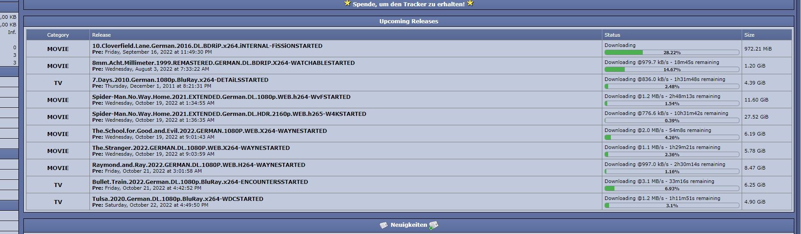

<p align="center">
  <br>
  
</p>

<h2 align="center">ATUS tracker API plugin</h2>

Generic tracker API to interact with [ATUS](https://github.com/SteffenLoges/atus).<br>

## Before you start

This API was build to make it easy to set up and to work with as many different tracker configurations as possible.<br>
The default configuration should be seen as a starting point and should be adjusted to your needs.<br>
We have presets for TBDev and NetVision, but depending on your setup, you may need to heavily modify the code to make it work.

_The installation guide assumes that you are running a linux system with nginx and php5.6 or higher installed._

## Screenshots

#### TBDev

 

#### NetVision

 

## Prerequisites

You need a running and web accessible instance of [ATUS](https://github.com/SteffenLoges/atus).

## Installation

1. [NGINX configuration](#nginx-configuration)
2. [API installation](#api-installation)
3. Frontend configuration
   - [Integration into TBDev](#integration-into-tbdev)
   - [Integration into NetVision](#integration-into-netvision)

## NGINX configuration

We need to set up a reverse proxy to securely serve release images, screenshots and stream sample videos directly from the ATUS server to your users.

Add the following snippet to your tracker's NGINX vhost configuration:

```nginx
location /atus-proxy/ {
  limit_except GET {
    deny all;
  }

  # Replace [ATUS-SERVER-IP] with the IP of your ATUS server
  proxy_pass http://[ATUS-SERVER-IP]:8000/api/;
  proxy_http_version  1.1;
  proxy_cache_bypass  $http_upgrade;

  # Enter your authentication token here
  # You can find the token in your ATUS webinterface under "API"
  proxy_set_header Authorization "xxxxxxxx-xxxx-xxxx-xxxx-xxxxxxxxxxxx";

  proxy_set_header Host              $host;
  proxy_set_header X-Forwarded-For   $remote_addr;
}
```

## API installation

1. Clone this repository and copy the `atus` folder to your tracker's root directory.

2. Make the `atus/data` folder writable by your webserver.

   ```bash
   chown -R www-data:www-data atus/data
   ```

   ```bash
   chmod -R 0700 atus/data
   ```

3. Open `atus/config.php` and enter your settings.

4. Open `atus/Release.php`. <br>
   This is where you define how a new upload is handled.<br>
   Read the comments carefully and modify the code to fit your tracker's needs.<br>
   You can always see if your code is working by uploading a test release through the ATUS webinterface under "Upload Settings" -> "Upload Test Release".

## Integration into TBDev

#### Release details

1. Open your `details.php` file and find the following code:

   ```php
   $HTMLOUT .= tr("{$lang['details_info_hash']}", $row["info_hash"]);
   ```

2. Add the following code below:

   ```php
    require_once __DIR__ . '/atus/mixins/details.php';
   ```

#### Upcoming releases

1. Open your `index.php` file and find the following code:

   ```php
   $HTMLOUT = '';
   ```

2. Add the following code below:

   ```php
   if (isset($CURUSER)) {
     require_once __DIR__ . '/atus/mixins/upcoming-releases/index.php';
   }
   ```

## Integration into NetVision

#### Release details

1. Open your `details.php` file and find the following code:

   ```php
   tr("Hash-Wert", preg_replace_callback('/./s', "hex_esc", hash_pad($row["info_hash"])));
   ```

2. Add the following code below:

   ```php
    require_once __DIR__ . '/atus/mixins/details.php';
   ```

#### Upcoming releases

1. Open your `index.php` file and find the following code:

   ```html
           <center><b> star16.gif"> <a href="donate.php">Spende, um den Tracker zu erhalten!</a> star16.gif"></b></center>
       </span></td>
   </tr>
   </table>
   <br>
   ```

2. Add the following code below:

   ```php
   <?php
   if (isset($CURUSER)) {
     require_once __DIR__ . '/atus/mixins/upcoming-releases/index.php';
   }
   ?>
   ```

## Notes

#### Tested with

- [TBDev](https://github.com/tbdevnet/tbdev)
- [NetVision](https://github.com/SteffenLoges/netvision-tracker)

## License

[MIT](https://choosealicense.com/licenses/mit/)
